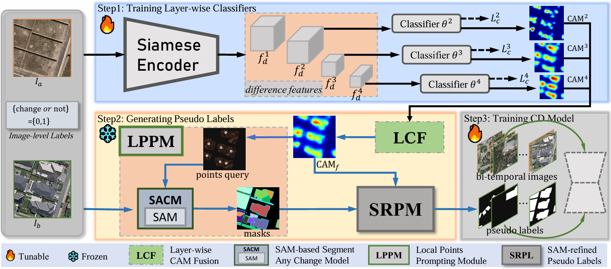

# <p align=center>`Enhancing Weakly Supervised Change Detection with Layer-wise CAM Fusion and SAM-refined Pseudo Labels`</p>


## News
Repo is created in 2025-01-26. Code will come soon.

## code is still being organized and constantly updated

### 1. Overview

<p align="center">
     <br />
</p>

`LCF generates a more comprehensive change activation map. LPPM converts the CAM into query points for SAM-based SACM, producing more accurate and reliable change masks. SRPL combines coarse seeds with precise boundary masks to refine pseudo-label quality.` <br>

### 2. Usage
#### 2.1 Dataset
+ Prepare the data:
    Download the change detection datasets from the following links. Place them inside your `datasets` folder.

    - [`LEVIR-CD`](https://www.dropbox.com/s/18fb5jo0npu5evm/LEVIR-CD256.zip?dl=0)
    - [`WHU-CD`](https://www.dropbox.com/s/r76a00jcxp5d3hl/WHU-CD-256.zip?dl=0)
- Crop all datasets into 256x256 patches.
- Generate list file as `ls -R ./label/* > test.txt`
- Generate image-level annotations as `...`
    - `./datasets/LEVIR/imagelevel_labels.npy`
    - `./datasets/WHU/imagelevel_labels.npy`
- Prepare datasets into following structure and set their path in `train.py` and `test.py`
  ```
  ├─A
      ├─A1.jpg/png
      ├─A2.jpg/png
      ├─...jpg/png
      └─...jpg/png
  ├─B
      ├─B1.jpg/png
      ├─B2.jpg/png
      ├─...jpg/png
      └─...jpg/png
  ├─label
      ├─label1.jpg/png
      ├─label2.jpg/png
      ├─...jpg/png
      └─...jpg/png
  ├─list
      ├─train.txt
      ├─val.txt
      └─test.txt
  ```
#### 2.2 Setting up conda environment
+ Prerequisites for Python:
    - Creating a virtual environment in terminal: `conda create -n EWSCD python=3.8`
    - Installing necessary packages: `pip install -r requirements.txt `

#### 2.3 Installation
+ Clone this repo:
    ```shell
    git clone xxxxxx
    cd xxxxxx
    ```
